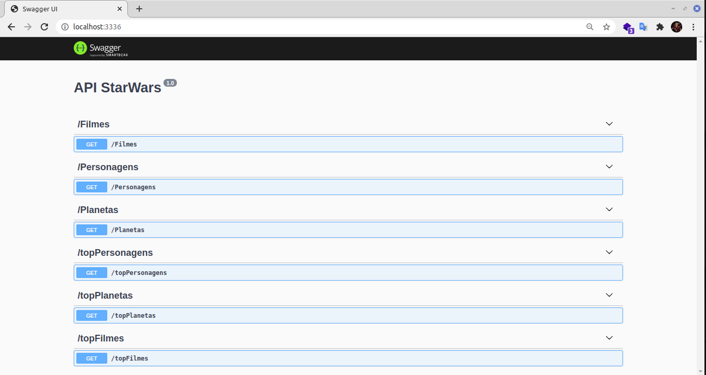
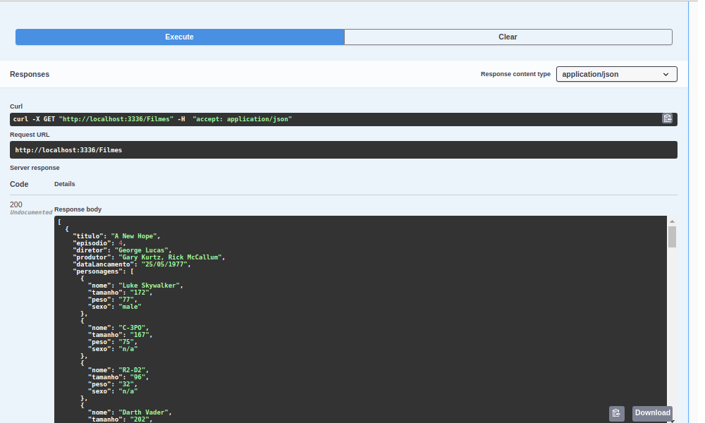

## Integração com a API do StarWars
-                                 Node.js | Knex.JS | Docker | Swagger

## :bookmark: Introdução

A **API swapi** é uma api para listar Filmes, Planetas e Personagens do universo StarWars buscando as informações do site https://swapi.dev/
Link ao Repositorio do DockerHub, contendo uma imagem da API 
-[DockerHub](https://hub.docker.com/repository/docker/giovannivecchi/swapi)

## :rocket: Tecnologias

-  [Node.js](https://nodejs.org/en/)
-  [Express](https://expressjs.com/)
-  [axios](https://github.com/axios/axios)
-  [sqlite3](https://www.sqlite.org/)
-  [knex](http://knexjs.org/)
-  [Swagger](https://swagger.io/)

  
## :bookmark: Necessidade

Caso não utilize o docker , necessário a instalação do Node.js para execução da API


2. Executando a Aplicação:

```sh

  # ----- Instalando as dependências do projeto.
  # npm install
  #
  # ----- Instalando o Banco de dados.
  # npm run knex:migrate
  #
  # ----- Inicie a API
  # npm start


  #DOCKER
  #----- Caso não efetue o processo acima baixe a imagem no DockerHub)
  #https://hub.docker.com/repository/docker/giovannivecchi/swapi
  #
  #----- Ou execute 
  #docker pull giovannivecchi/swapi
  #----- E iniciei
  #docker run -p 3336:3336 -d giovannivecchi/swapi

```
## :Documentação: Swagger


Após a instalação a url **http://localhost:3336/** exibirá a documentação da API mostrando as rotas disponiveis para aplicação. 



